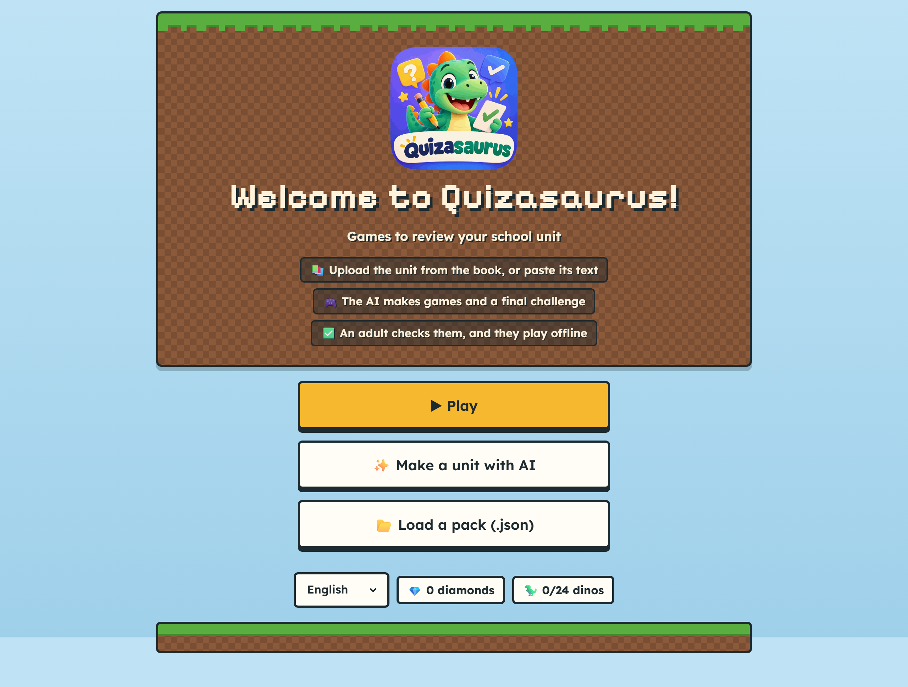
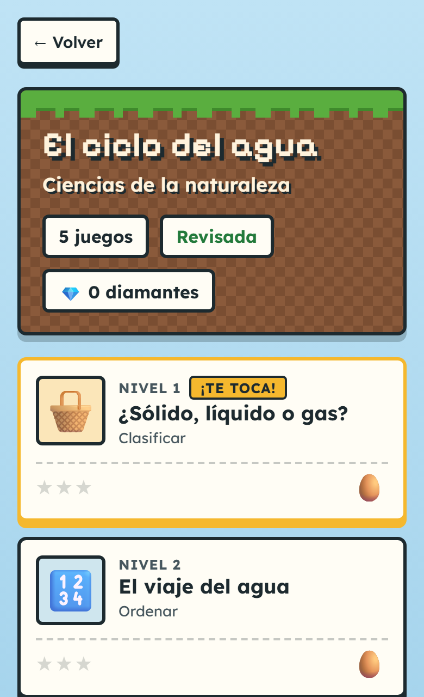
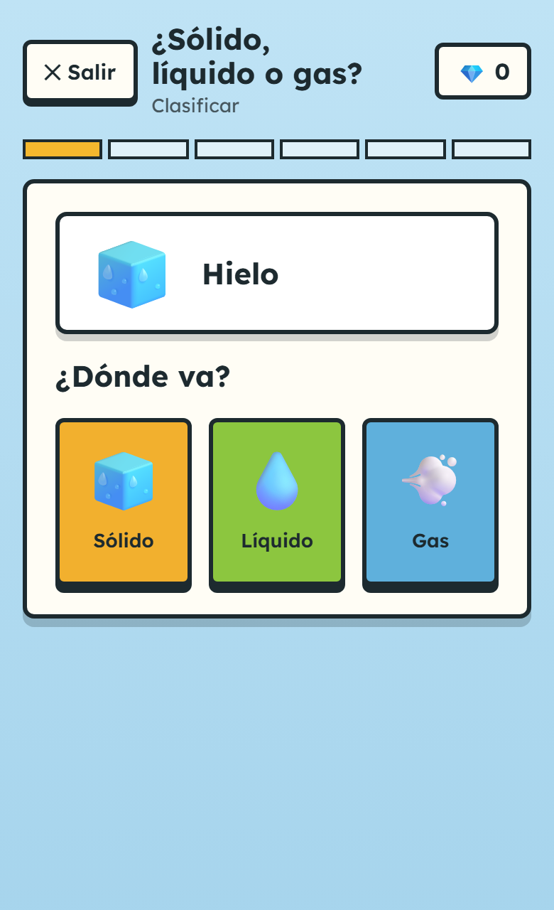
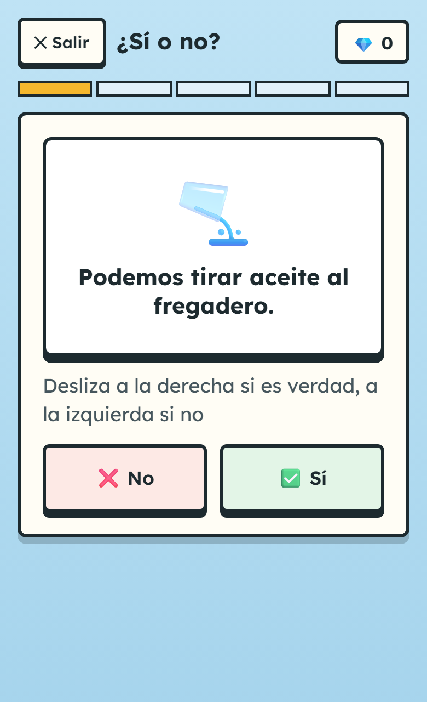
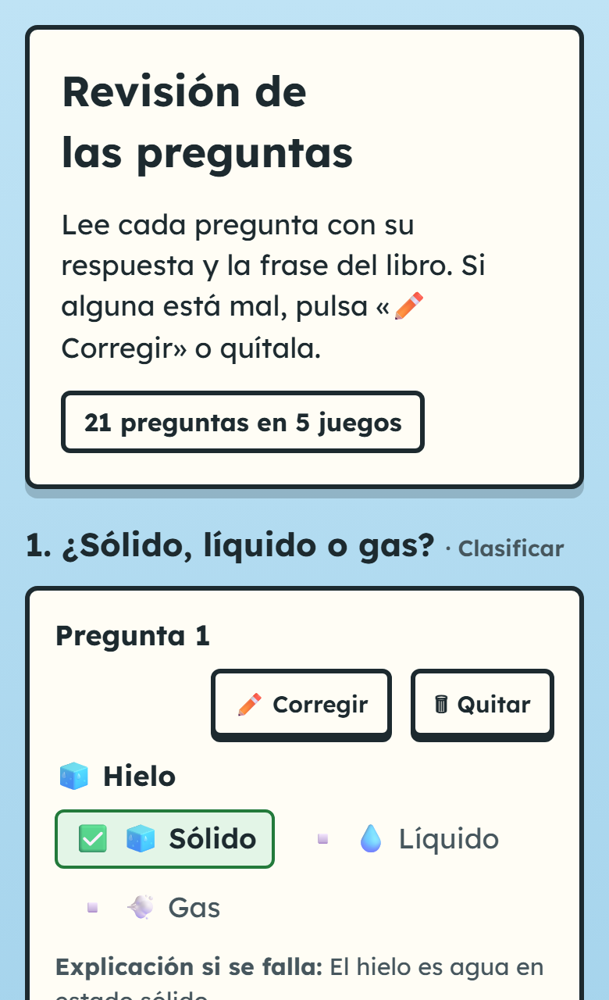
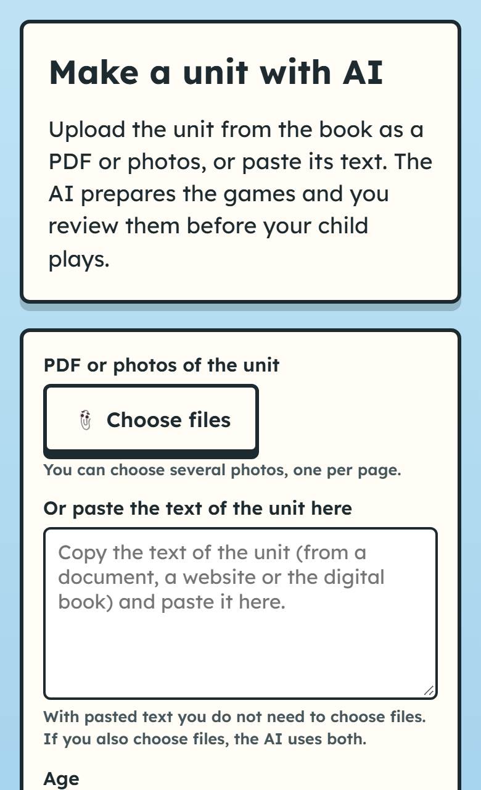

<p align="center"></p>

# Quizasaurus

**Turn any lesson into games, with the AI you choose.**

Quizasaurus turns a school unit (a PDF, photos of the textbook or its text) into a pack of learning games and a final "boss" quiz that children play offline on a tablet or phone. An adult reviews every question first. Open source, no accounts, no ads.

**▶ Try it: [marcelopereagarcia-sys.github.io/Quizasaurus](https://marcelopereagarcia-sys.github.io/Quizasaurus/)** — it opens with an example unit ready to play.

> **Version 1.0** · October 2026 · *Resumen en castellano [al final](#en-español).*

> 📋 **Also a project-management case study.** Run by Marcelo Perea as project manager with the Google Project Management method, and built by an AI assistant (Claude) under his direction: delivered in **4 days instead of the 14 planned**, with **~38 hours of the 112 budgeted** and **€0 spent**. **[Read the case study →](docs/case-study.md)** · [en castellano](docs/caso-de-estudio.md)

<p align="center"></p>

<p align="center">
  
  
  
  
  
</p>
<p align="center"><sub>The example unit, «El ciclo del agua» (the water cycle), in Spanish: inside a unit the app speaks the unit's language.</sub></p>

---

## Why

It started as a weekend prototype to help my son, in 3rd grade, prepare a science exam: three play sessions, six levels, a dinosaur collection and a T-Rex boss. Quizasaurus turns that one-off into a tool any family or teacher can use with their own material, in any country.

## How it works

```text
PDF / photos / text ──> Reader ──> Generator ──> Pack (JSON) ──> Adult review ──> Offline player (PWA)
                                   your AI: Gemini · Claude · OpenAI · Ollama
```

1. **The AI only writes content, never game code.** Games are fixed, tested templates; the AI fills them with questions checked against a schema, and every question quotes the sentence of the book it comes from.
2. **Open pack format.** A pack holds the questions, the game type, the source sentence, the language and the age of the children. Packs can be shared. See [the pack format](docs/pack-format.md).
3. **Bring your own AI.** Use your own key (Gemini has a free tier) or run a local model with Ollama. The project has no servers and no per-use cost.
4. **An adult reviews every pack** before a child plays it.
5. **Offline player.** Installs from the browser on any tablet or phone and works without internet.

## Use it

### 1. Make a unit

Choose **Make a unit with AI** (a quick multiplication keeps children out), then:

- **Upload** the PDF or photos of the unit, **or paste its text**.
- Pick the **age** of the child (5 to 15), the **language** of the unit (Catalan, Spanish or English, or let the app detect it) and the **AI**.
- Wait for three steps: read the unit, write the questions, check them. The pack goes straight to the review.

About the AI:

- **Gemini** is recommended: it scored 98.9 % in our model comparison and has a free tier. Get a key at [Google AI Studio](https://aistudio.google.com/apikey) (sign in, accept the terms, **Create API key**); the app shows these steps too. On the free tier, [Google may use what you send to improve its products](https://ai.google.dev/gemini-api/docs/pricing).
- **Your key stays on your device** (browser storage) and is sent only to the provider you chose. You can delete it from the same screen.
- **Ollama on your computer** needs no key, but it must allow the app's website: start it with `OLLAMA_ORIGINS=https://marcelopereagarcia-sys.github.io` (or `*`).
- With a cloud AI, the text of the unit and any photos leave your device: photograph pages with no names or handwriting.

### 2. Review it

Each question shows its right answer in green and the sentence from the book. Read them at a glance, open **Fix** only on the ones that are wrong (or **Remove** them), and approve the unit. Only approved units can be played.

### 3. Play

Every game is a level: sort items into groups, put steps in order, pick the right option, swipe yes or no, and beat the final boss. Children tap and drag, never type. They earn diamonds and stars, hatch dinosaur eggs into a collection, and can keep practising in an endless mode. **Play** always goes on from the next level, and the corner for families shows what the child knows and what to review.

### 4. Share it

Made the unit on your phone and the child plays on a tablet? Choose **Share**: send the link (by WhatsApp, email…; the unit travels inside the link, never through a server) or save it as a file and open it with **Load a pack** on the other device.

## For developers

```bash
git clone https://github.com/marcelopereagarcia-sys/Quizasaurus.git
cd Quizasaurus
npm install
npm run dev
```

- [CONTRIBUTING.md](CONTRIBUTING.md): set up the project, run the tests and the audit, add a language or a skin, and the ideas open to the community.
- [docs/pack-format.md](docs/pack-format.md): every field and rule of a pack, to write or fix packs by hand.
- Stack: TypeScript, Preact and Vite (a PWA), Zod for the pack format, Vitest and Playwright. Every deploy runs the typecheck, the tests and an automatic audit that plays the whole app at phone, tablet and laptop sizes.

## A public case study in AI-assisted project management

This repository is also a portfolio piece: **[the case study](docs/case-study.md)** tells the whole story on one page, in English. It is run with the Google Project Management method (hybrid: a waterfall frame with phase gates, and one-day Scrum sprints in Jira), and every artifact is public:

| Artifact | Where |
| --- | --- |
| Case study: role, decisions, results against objectives, lessons | [`docs/case-study.md`](docs/case-study.md) · [castellano](docs/caso-de-estudio.md) |
| Project charter, status reports, family test, closure report, retrospective (in Spanish) | [`docs/gestion`](docs/gestion/) |
| Architecture decision records (in Spanish) | [`docs/adr`](docs/adr/) |
| The working rules the AI follows in every session | [`CLAUDE.md`](CLAUDE.md) |

**How it is built:** Marcelo Perea is the project manager and product owner: he sets the goals, makes the decisions and accepts the work. Development, testing and documentation drafts are done with [Claude](https://claude.com/claude-code) as an AI assistant, under written rules, with evidence for every acceptance criterion and automatic quality and privacy checks. See [how the AI was directed](docs/case-study.md#how-the-ai-was-directed).

## Privacy and content rules

- No accounts, no tracking, no data about children leaves the device.
- Textbook scans and packs made from copyrighted books are never committed to this repository.
- No trademarks in themes or names.

## Contributing

New languages, skins, example packs and improvements are welcome. Read [CONTRIBUTING.md](CONTRIBUTING.md).

---

## En español

**Quizasaurus convierte un tema del colegio (PDF, fotos del libro o su texto) en juegos y un reto final que el niño juega sin conexión, en la tableta o el móvil.** Un adulto revisa antes cada pregunta.

- **Pruébalo:** [marcelopereagarcia-sys.github.io/Quizasaurus](https://marcelopereagarcia-sys.github.io/Quizasaurus/) (en catalán, castellano o inglés).
- **Cómo se usa:** «Crear una unidad con IA», sube el tema o pega su texto, elige la edad (de 5 a 15 años), revisa las preguntas y a jugar. Para pasarla a otro aparato, «Compartir» por enlace o por archivo.
- **La IA que elijas:** Gemini (con nivel gratuito), Claude, OpenAI u Ollama en tu ordenador. La clave se queda en tu aparato.
- **Código abierto (MIT)**, sin cuentas ni anuncios. Nació de un prototipo hecho en un fin de semana para el examen de Medi de mi hijo, en 3.º de primaria.
- **Caso de gestión de proyectos con IA:** entregado en 4 días en lugar de 14, con unas 38 horas de las 112 previstas y 0 €. Todo el caso en una página: [caso de estudio](docs/caso-de-estudio.md); el charter, los informes de estado, el informe de cierre y la retrospectiva están en [`docs/gestion`](docs/gestion/).

## License

[MIT](LICENSE) © 2026 Marcelo Perea García

The player ships two fonts under the [SIL Open Font License 1.1](https://openfontlicense.org): [Pixelify Sans](https://github.com/eifetx/Pixelify-Sans) © 2021 The Pixelify Sans Project Authors, and [Lexend](https://github.com/googlefonts/lexend) © 2019 The Lexend Project Authors.
