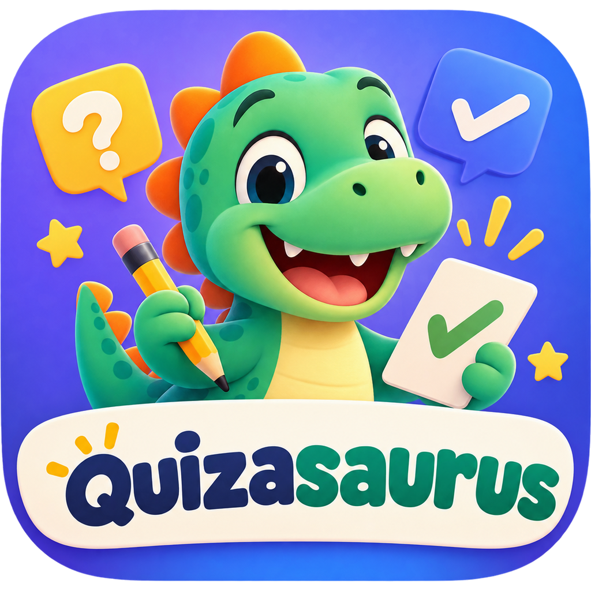

<p align="center"></p>

# Quizasaurus

**Turn any lesson into games, with the AI you choose.**

Quizasaurus turns a school unit (a PDF or photos of the textbook) into a pack of 5 learning games and a final "boss" quiz that kids play offline on a tablet. Open source, no accounts, no ads.

> 🚧 **Status: in development.** Two-week build, 5–18 October 2026. Follow the plan in [`docs/gestion`](docs/gestion/).

---

## Why

It started as a weekend prototype to help my son, in 3rd grade, prepare a science exam: three play sessions, six levels, a dinosaur collection and a T-Rex boss. Quizasaurus turns that one-off into a tool any family or teacher can use with their own material.

## How it works

```text
PDF / photos ──> OCR ──> Generator ──> Pack (JSON) ──> Adult review ──> Offline player (PWA)
                          your AI: Ollama · Claude · OpenAI · Gemini
```

1. **The AI only writes content, never game code.** Games are fixed, tested templates; the AI fills them with questions validated against a schema.
2. **Open pack format.** A pack holds the questions, the game type, the source sentence from the book, language and grade. Packs can be shared.
3. **Bring your own AI.** Run a local model with Ollama for free, or use your own API key. The project has no servers and no per-use cost.
4. **An adult reviews every pack** before a child plays it, with the source sentence shown next to each question.
5. **Offline player.** Installs from the browser on any tablet and works without internet.

### Make a unit from the web app

Open the app, choose **Make a unit with AI** (an adult gate comes first), upload the PDF or photos of the unit, pick the year, the language and the AI, and wait for the three steps: read, write the questions, check them. The new pack goes straight to the adult review.

- **Gemini** is recommended: it scored 98.9 % in our model comparison and has a free tier. Get a key at [Google AI Studio](https://aistudio.google.com/apikey) (sign in, accept the terms, **Create API key**); the app shows these steps too. On the free tier, [Google may use what you send to improve its products](https://ai.google.dev/gemini-api/docs/pricing).
- **Your key stays on your device** (browser storage) and is sent only to the provider you chose. You can delete it from the same screen.
- **Ollama on your computer** needs no key, but it must allow the app's website: start it with `OLLAMA_ORIGINS=https://marcelopereagarcia-sys.github.io` (or `*`).
- With a cloud AI, the text of the unit and any photos leave your device: photograph pages with no names or handwriting.

## A public case study in AI-assisted project management

This repository is also a portfolio piece. It is run with the Google Project Management method (hybrid: a waterfall frame and daily Scrum sprints in Jira), and every artifact is public:

| Artifact | Where |
| --- | --- |
| Project charter, risk register, status reports | [`docs/gestion`](docs/gestion/) |
| Architecture decision records | [`docs/adr`](docs/adr/) |

**How it is built:** Marcelo Perea is the project manager and product owner: he sets the goals, makes the decisions and accepts the work. Development, testing and documentation drafts are done with [Claude](https://claude.com/claude-code) as an AI assistant. That split is intentional, and documented.

## Privacy and content rules

- No accounts, no tracking, no data about children leaves the device.
- Textbook scans and packs made from copyrighted books are never committed to this repository.
- No trademarks in themes or names.

---

## En español

**Quizasaurus convierte una unidad escolar (PDF o fotos) en 5 juegos y un examen final que el niño juega sin conexión.** Es código abierto (MIT), funciona con la IA que elijas (Ollama en local, Claude, OpenAI o Gemini) y no tiene cuentas ni anuncios. Nació de un prototipo hecho en un fin de semana para el examen de Medi de mi hijo, en 3º de primaria. La documentación de gestión del proyecto está en [`docs/gestion`](docs/gestion/).

## License

[MIT](LICENSE) © 2026 Marcelo Perea García

The player ships two fonts under the [SIL Open Font License 1.1](https://openfontlicense.org): [Pixelify Sans](https://github.com/eifetx/Pixelify-Sans) © 2021 The Pixelify Sans Project Authors, and [Lexend](https://github.com/googlefonts/lexend) © 2019 The Lexend Project Authors.
